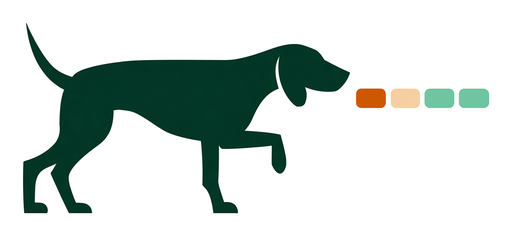

<picture>
  <source media="(prefers-color-scheme: dark)" srcset="docs/assets/birddog-logo-dark.png">
  
</picture>

# birddog

[](./LICENSE)

**Know what the coding agents on your machine are doing — and which one is
waiting on you — without ever touching them.**

birddog watches live Claude Code, Codex and opencode sessions on one machine
and tells an orchestrating agent what it observed: a session went idle, asked
for input, exited, or went quiet. It never sends a prompt, never approves
anything, and never starts, stops or restarts a session.

**birddog monitors sessions; it does not manage their work.** Stopping birddog
leaves every watched agent running.

It is the observation third of a small family:
[muster](https://github.com/BrutalSystems/muster) launches instructed agents,
[tincan](https://github.com/BrutalSystems/tincan) lets them message each other,
birddog watches them.

> **Status: working, early.** Instances run, observe all three runtimes,
> report what deserves attention, and deliver alerts to an orchestrator over
> either of two routes. What each runtime actually exposes — and does not — is
> in [`docs/providers.md`](./docs/providers.md).

## What it's for

Running more than one agent and not sitting over them. A worker that finished
and a worker blocked on a question look identical from outside — both idle,
both silent — and the difference is the one that costs you an afternoon.
birddog is the part that tells them apart and says so, so an orchestrator can
act on it instead of polling terminals.

## What makes it different

- **It reports what it saw, never what it assumes.** "Looked and saw nothing"
  and "no way to look" are different answers, and collapsing them is what lets
  silence pass for evidence that a worker is unblocked. birddog keeps them
  apart in every field it fills.
- **It refuses to guess a state.** A status outside the vocabulary it has
  established is reported as unreadable rather than mapped to the nearest
  familiar word.
- **Every answer says how it was reached.** An observed input request carries
  whether it came from the runtime's own record, from birddog's hooks, or from
  reading the conversation — so a consumer can trust one and discount another.
- **It touches nothing.** No adapter resumes a conversation, starts a turn, or
  injects a prompt to find out what is happening. Reading is the whole of it.
- **Claims are pinned to versions.** Runtime behaviour is established by
  driving the real programs and recording what they did. Where a claim was
  later measured to be wrong, the correction is in the git history rather than
  quietly edited away.

## Quick start

```sh
npm i -g @brutalsystems/birddog        # macOS, Apple silicon
birddog discover                       # what can be watched
birddog doctor                         # what can and cannot be observed
```

The package carries the compiled binary, so nothing is built at install time
and no Go toolchain is needed. From a clone, or without npm:

```sh
go build -o birddog ./cmd/birddog
```

Then watch something. Take a `session_id` (and, for Claude Code, the `pid` and
`proc_start` beside it) from `discover` into a config — see
[`examples/`](./examples/) — and start an instance:

```sh
birddog start --config birddog.json
birddog status --instance <id>
birddog events --instance <id> --after <cursor> --wait 25
birddog stop --instance <id>
```

The instance keeps observing after the shell that started it is gone, and
stopping it leaves every watched session running.

```
TARGET        PROVIDER  STATUS         ATTENTION
api-refactor  claude    running_tool   —
auth-thread   codex     unavailable    —
checkout-7f   claude    waiting_input  input_requested
```

## Seeing more

Three things birddog cannot observe from outside a session. All are opt-in,
and none changes what a watched session does.

```sh
birddog hooks install      # Claude Code: tool calls and permission requests
```

```toml
# opencode: nothing outside the process can see it at all
[plugins.birddog]
npm = "@brutalsystems/birddog-opencode"
```

Claude Code again, for a session blocked on a question asked in plain prose —
named per target in the watch list, because it is work on every pass and one
of its two signals is a heuristic an operator should choose rather than
inherit:

```json
{ "id": "worker-1", "provider": "claude",
  "observations": { "transcript": true } }
```

Sessions already running pick hooks up without restarting. Everything here
preserves what is already configured, and can be removed.

## Getting told

Alerts go to the orchestrator that configured birddog, never to a watched
worker, and are queued for a turn boundary rather than interrupting one.

| Route | Reaches | Needs |
|---|---|---|
| `claude-inbox` | a Claude Code orchestrator | nothing |
| `tincan` | Claude Code, Codex or opencode | [tincan](https://github.com/BrutalSystems/tincan) 1.10.1+ on `PATH` |
| `none` | nothing; poll `events` instead | nothing |

Delivery failure never affects observation. Whatever happens to an alert, the
event feed still has it.

## What it will not tell you

Liveness is only ever reported on evidence. A Claude Code session is live when
its socket answers **and** the process at its PID is still the one the registry
recorded; a Codex thread is live when a running process holds its writer lock.
When the evidence fails, the last observed status is preserved and marked
`(stale)` rather than presented as current.

`unavailable` is a real answer, not a gap to be filled in. Codex reports its
threads as `notLoaded` to anyone who does not own them, which describes the
asking process rather than the session — so birddog says it cannot see the
state instead of guessing one.

Nor will it tell you a worker is unblocked. A question reaches a human two
ways and the runtime's own record sees only one of them: a Claude Code session
blocked on an `AskUserQuestion` menu reports `waiting`, while one that asked in
plain prose reports `idle`, indistinguishable from a turn that simply ended.
Transcript reading is what separates those two, and it says which of them it
found. An absence of observation is never reported as evidence of absence, and
a turn ending is not work finishing.

## Requirements

**macOS on Apple silicon.** The npm package ships one prebuilt arm64 binary, so
a global install refuses anything else rather than building from source.
Building from a clone needs **Go 1.26+**; the plugin suite needs Node.

Then whichever agents you mean to watch. Verified against **Claude Code
2.1.267** and **2.1.274**, **Codex CLI 0.155.1**, and **opencode 1.18.31** —
what that verification covers, and what it does not, is in
[`docs/providers.md`](./docs/providers.md).

## Documentation

|  |  |
| --- | --- |
| [providers.md](./docs/providers.md) | what each runtime exposes to an outside observer, and what it does not — **authoritative** |
| [decisions.md](./docs/decisions.md) | what was decided, and what it costs — **binding** |
| [cli.md](./docs/cli.md) | every command, its output, and the error codes |
| [architecture.md](./docs/architecture.md) | how the pieces fit, and the decisions that shaped them |
| [troubleshooting.md](./docs/troubleshooting.md) | what the surprising answers mean |
| [acceptance.md](./docs/acceptance.md) | every acceptance criterion, and what is not done |
| [docs/README.md](./docs/README.md) | the full index, and what supersedes what |

## Keeping it up to date

Publishing a release does not touch an installed copy: `birddog --version`
keeps reporting the old version until you update it.

```sh
npm update -g @brutalsystems/birddog
```

If `which birddog` resolves to a version-manager shim (for example
`~/.asdf/shims/birddog`), run that update under the Node the shim resolves to
and reshim afterwards — `asdf reshim nodejs` — or the shim keeps pointing at
the old binary.

The opencode plugin is fetched by opencode from its own npm specifier and is
never installed by hand. opencode caches that specifier and does not revisit
it, so a session can keep loading an older plugin after a newer one ships.

## Build and run locally

`make check` is the local gate, and is exactly what CI runs: `gofmt`, `go vet`,
`go test ./... -race`, the plugin typecheck and the plugin suite. Passing it
locally and failing in CI should not be possible.

```sh
make check
go build -o birddog ./cmd/birddog
./birddog discover
./birddog doctor
```

## Scope of the first version

Claude Code, Codex and opencode. Terminal and programmatically launched
sessions. One machine — birddog observes what is running beside it and has no
network listener. Desktop apps are out of scope.

## License and releases

MIT © 2026 BrutalSystems. See [LICENSE](./LICENSE).

Publishing is tag-driven and runs in GitHub Actions over OIDC trusted
publishing, with no stored npm token anywhere in this repository. A bare
`git push` publishes nothing; a version tag is what triggers `publish.yml`,
which publishes the CLI and the opencode plugin together from the same tag in
the same version.

There is no `RELEASE_NOTES.md` here. The GitHub Release is created with
`--notes-from-tag`, so the tag annotation **is** the public release record —
which is why the message is not optional:

```sh
npm version <patch|minor|major> -m "%s — <what changed>"
```

Ordinary semver from 1.0: **major** for a change to what a consumer relies on
— the shape of an event or status record, the CLI surface a script calls, or
the meaning of a reported state — **minor** for a feature that leaves existing
readers correct, **patch** for a fix. Releases before 1.0 were made under a
different rule, where the minor carried that signal.
[RELEASING.md](./RELEASING.md) covers it in full.
